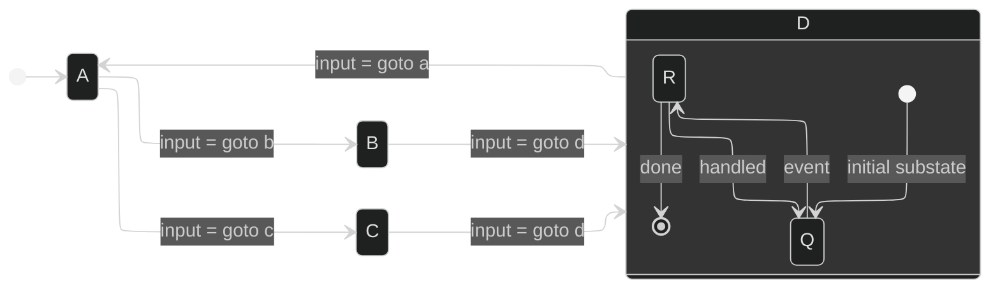

# BNF Grammar

TRANSITION:: STATE --> STATE
COMPOSITE*STATE : "{" TRANSITION COMPOSITE_STATE "}"
STATE:: [A-Z | a-z | * ] [A-Z | a-z | 0-9 | _ ]\*

## prompt

Create a program that paccepts text input using the BNF grammar in file grammar.bnf. use the python programming language in file grammar.py
