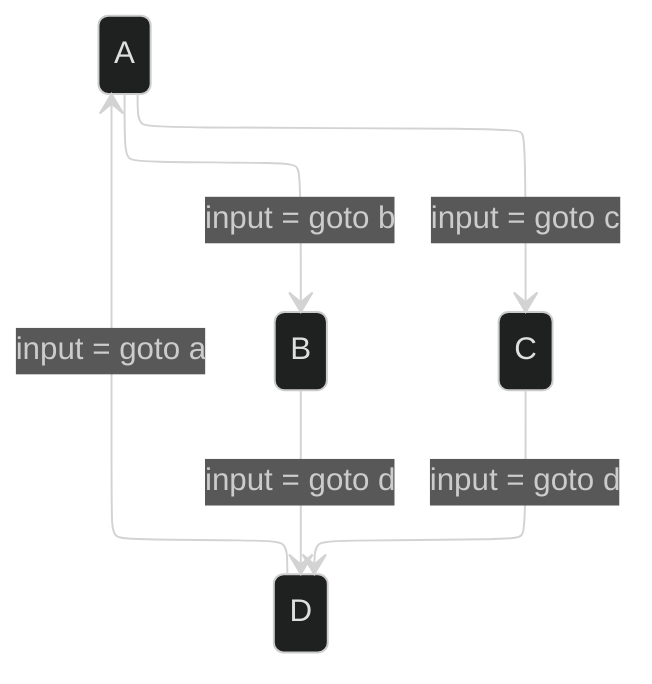

```mermaid
---
config:
  layout: elk
  look: classic
  theme: dark
---
stateDiagram-v2
A --> B: input = goto b
A --> C: input = goto c
B --> D: input = goto d
C --> D: input = goto d
D --> A: input = goto a
```
