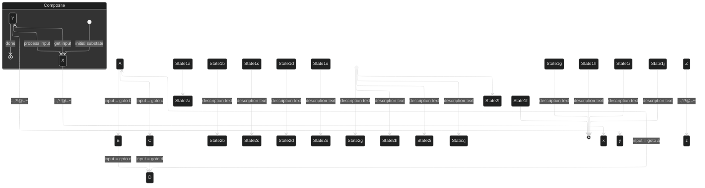

```mermaid
---
config:
  layout: elk
  look: classic
  theme: dark
---
stateDiagram-v2


%% get states from composite definition %%
%% composite states not supported yet %%
state Composite {
  [*] --> X: initial substate
  X --> Y: get input
  Y --> X: process input
  Y --> [*]: done
}

%% test transitions with and without descriptions %%
A --> B : input = goto b
A --> C : input = goto c
B --> D : input = goto d
C --> D : input = goto d
D --> A : input = goto a

%% test transitions with and without descriptions %%
State1a --> State2a
State1b --> State2b : description text
State1c --> State2c:description text
State1d --> State2d: description text
State1e --> State2e :description text

%% test transition with start symbol %%
[*] --> State2f
[*] --> State2g : description text
[*] --> State2h:description text
[*] --> State2i: description text
[*] --> State2j :description text

%% test transition with end symbol %%
State1f --> [*]
State1g --> [*] : description text
State1h --> [*]:description text
State1i --> [*]: description text
State1j --> [*] :description text

%% test description with special characters %%
X --> x: :.,?!@=~
Y --> y::.,?!@=~
Z --> z: : .,?!@=~

```
